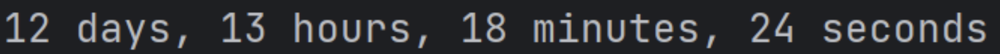

# Analysis on a Covid-19 dataset
``` python
print("No path found")
return None
```
## Table of content 

- [Context](#context)
- [Formatting](#formatting)
- [Bayesian Network](#bayesian-network-)
- [Machine Learning models](#machine-learning-models)

## Context

This repository tries to analyze a dataset concerning the COVID-19 quick spread. 
The data used can be found on this repository: https://github.com/beoutbreakprepared/nCoV2019/tree/master

## Formatting

The dataset contains much information and is quite complete. 
Unfortunately, all columns are not usable in the actual state, as most of them are string and many rows have null value. 
The objective is to format the data so that performing the analysis becomes simpler. We then work with the [cleaned dataset](data/cleaned_dataset.csv).
The final cleaned dataset has 307382 rows and the following features:


More information about how the dataset have been formatting can be found here: [the format data markdown](format_data/README_formatting.md).

## Analysis 

Now that our dataset is ready to be used, we can perform multiple analysis on it. 
We choose to compute a correlation matrix, focusing on the target feature: the outcome of the patient.  


We also create scatter plots concerning the features 'outcome' and 'age' and can be found here: [scatter plots](data/scatter_plots).

Finally, we perform a PCA restraining to the features most correlated to the target value: the outcome. 


## Machine Learning models

The next step is to use this dataset to try to use this dataset to make some prediction. 
We are going to use 1 graphical model - the Bayesian Network - 1 linear regression model and 2 machine learning models to do so: K-Nearest-Neighbors and K-Means. 

More information about each model in the [model README](models/README_models.md).

### Bayesian Network

First, we are going to compute some probabilities thanks to the following Bayesian Network. 


We compute the probability for someone to have symptoms if the person visited Wuhan:  


The probability for someone to have symptoms if the person visited Wuhan: 


And the probability for a person to be a true patient if this person has symptoms of
COVID-19 and this person visited Wuhan:  


We can also predict the average recovery interval for a patient if this person visited Wuhan:



### K-Nearest-Neighbors (KNN)

We use the KNN model to predict patients' outcome. A lot of them are still hospitalized, and it could be interesting 
to predict their outcome based on the dataset other features. We divide the dataset in two different: 
one for patients whose outcome is known, one for those whose outcome isn't known. 

We train our model with the first dataset and test the accuracy and the confusion matrix on the results obtained with this dataset. 
We obtain: 


Then, we use our model to predict the outcomes of the dataset composed of hospitalized patients. 
We can compare the repartition of death and recovery predicted by the model with the actual proportion of the first dataset. 
As a reminder, 0 is death and 2 recovery. We obtain:


We can notice that the repartition is quite similar. 

### Linear regression model

We have 272947 patients who don't have an age, while it is important information for a person. 
We use a linear regression model to predict the age of the patients. 


